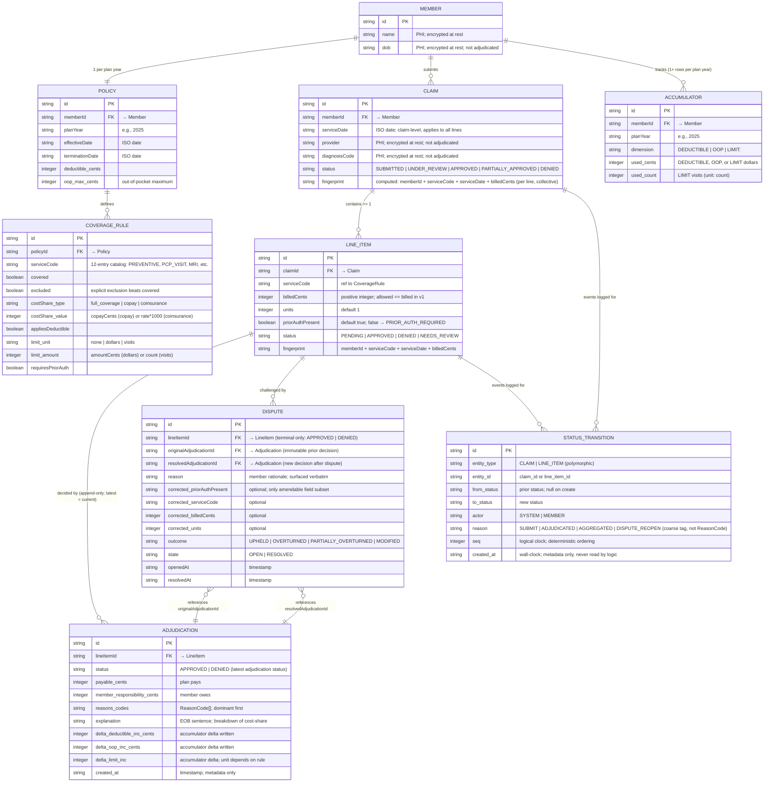

# Entity-Relationship Diagram — Claims Adjudication

> Source of truth: `docs/domain-model.md` (lines 15–36) and `docs/adjudication-plan.md`. If code drifts from these docs, the code wins and this diagram is updated.

## Mermaid ERD



## Legend & Modeling Notes

### Cardinality & Semantics

- **Member ↔ Policy**: One active policy per plan year. A member may have multiple policies across years, but at any point in v1, one member binds to one policy for the active plan year.
- **Policy → CoverageRule**: One-to-many; each rule is scoped to a policy and service code (unique composite key: `policyId + serviceCode`).
- **Member → Claim**: One-to-many; a member submits one or more claims.
- **Claim → LineItem**: One-to-many; a claim must have ≥1 line item.
- **LineItem → Adjudication**: One-to-many, append-only. Each line accumulates an ordered history of adjudications; the **latest** is the current decision. Disputes trigger a new adjudication row; the original is never mutated.
- **LineItem → Dispute**: One-to-many; a terminal line (`APPROVED` or `DENIED`) can be challenged zero or more times. Disputes are first-class (decision #16).
- **Dispute → Adjudication (bidirectional)**: Each dispute references two adjudications:
  - `originalAdjudicationId`: the immutable decision being challenged.
  - `resolvedAdjudicationId`: the new decision produced by re-adjudication.
- **Member → Accumulator**: One-to-many. At minimum, one row per plan year per accumulator dimension (DEDUCTIBLE, OOP). Per-service limits create additional rows lazily on first use (e.g., `LIMIT:MRI`). Total: ≥2 rows per member per plan year, growing with the number of service codes used.
- **Claim & LineItem → StatusTransition**: Both entities log transitions to the **same shared, append-only table**. `entity_type` + `entity_id` identify which entity changed. See *Polymorphic FK* below.

### Cost-Share (Discriminated Union)

The `CoverageRule.costShare` is a discriminated union; Mermaid flattens it as:
- `costShare_type`: `"full_coverage"` | `"copay"` | `"coinsurance"`
- `costShare_value`: 
  - **`full_coverage`**: (unused, reserved)
  - **`copay`**: `copayCents` (integer cents)
  - **`coinsurance`**: member's share rate × 1000 (e.g., 0.2 → 200 for 20%)

**In code**, this is:
```ts
costShare: 
  | { type: "full_coverage" }
  | { type: "copay"; copayCents: number }
  | { type: "coinsurance"; rate: number }
```

Adjudication logic switches on `costShare.type` to apply the correct cost-share math (decision #7 in adjudication-plan.md).

### Limit (Discriminated Union)

The `CoverageRule.limit` is a unit-typed discriminated union; Mermaid flattens it as:
- `limit_unit`: `"none"` | `"dollars"` | `"visits"`
- `limit_amount`:
  - **`none`**: (unused, reserved; no limit)
  - **`dollars`**: `amountCents` (integer; e.g., $500/year = 50000)
  - **`visits`**: `count` (integer; e.g., 20 PT visits/year)

**In code**:
```ts
limit:
  | { unit: "none" }
  | { unit: "dollars"; amountCents: number }
  | { unit: "visits"; count: number }
```

The `Accumulator.used_cents` and `Accumulator.used_count` map to the unit: dollar limits advance `used_cents`; visit limits advance `used_count`. Real benefits use exactly one mechanism per service.

### Polymorphic StatusTransition (Not Native to Mermaid ER)

`StatusTransition` is polymorphic: it logs state changes for *both* **Claim** and **LineItem**.

| entity_type | entity_id | Transitions |
|---|---|---|
| `CLAIM` | `claim_id` | `SUBMITTED → UNDER_REVIEW → {APPROVED, PARTIALLY_APPROVED, DENIED}` |
| `LINE_ITEM` | `line_item_id` | `PENDING → {APPROVED, DENIED, NEEDS_REVIEW}` |

**Foreign-key semantics**: `entity_id` is a **polymorphic FK** — it references either a `Claim.id` or a `LineItem.id` depending on `entity_type`. Mermaid ER does not natively express this (it cannot model a single column as a conditional FK). In SQL, this is enforced by application logic and/or trigger constraints; in the diagram, it appears as a separate relationship from `StatusTransition` *back* to both `Claim` and `LineItem` with the understanding that only one is populated per row.

**Invariant**: Every `Claim.status` and `LineItem.status` change is appended to `StatusTransition` in the same transaction via a single `setStatus()` helper (decision #15).

### Append-Only Tables

- **Adjudication**: Every time a line item is adjudicated (initial or dispute re-adjudication), a new row is appended. The `latest adjudication per line` is the current decision; history is retained for auditing and dispute evidence.
- **StatusTransition**: Every status change (submit, adjudicate, aggregate, dispute reopen) appends one row. Deterministic ordering uses the `seq` logical clock; `created_at` is metadata only.
- **Accumulator**: Rows are updated in place (by `delta` columns in Adjudication); they are not append-only. The deltas are what make re-adjudication deterministic (a dispute re-computes against `current − disputed line's original deltas`).

### PHI & Adjudication Isolation

- **Member.name**, **Member.dob**, **Claim.provider**, **Claim.diagnosisCode**: Personally identifiable health information. Marked as encrypted at rest and **not adjudicated** — the engine input is structurally typed to exclude them. They are captured for provider/member records but do not influence decisions.

### Fingerprint & Duplicate Detection

- **LineItem.fingerprint** and **Claim.fingerprint** (collective): Computed as `memberId + serviceCode + serviceDate + billedCents`. Used to detect duplicate submissions (step 0 in the adjudication pipeline). If a line with the same fingerprint is already adjudicated, the new submission is `DUPLICATE_LINE_ITEM`, payable 0.

### Reason Codes

Adjudication outcomes are classified by a dominant **ReasonCode**:

`APPROVED`, `NO_COVERAGE`, `EXCLUDED`, `LIMIT_EXCEEDED`, `DEDUCTIBLE_APPLIED`, `COPAY_APPLIED`, `COINSURANCE_APPLIED`, `OOP_MAX_REACHED`, `PRIOR_AUTH_REQUIRED`, `DUPLICATE_LINE_ITEM`, `POLICY_NOT_ACTIVE`, `DISPUTED_OVERRIDE`.

- **`APPROVED`**: Line approved; plan pays.
- **`PRIOR_AUTH_REQUIRED`**: Clean denial (step 4 of pipeline); not `NEEDS_REVIEW`.
- **`DISPUTED_OVERRIDE`**: Reserved for v2 reviewer override; **unused in v1**. An overturned dispute carries the re-derived reason codes, not this tag.

The `Adjudication.reasons` array carries the dominant code first; `explanation` provides the full EOB breakdown.

### Dispute Outcome Logic

| outcome | rule |
|---|---|
| `UPHELD` | Original decision reproduced (status, payable, reasons unchanged). |
| `OVERTURNED` | `DENIED → APPROVED`; no residual `LIMIT_EXCEEDED` reason. |
| `PARTIALLY_OVERTURNED` | `DENIED → APPROVED` with residual `LIMIT_EXCEEDED` shortfall (dollar-limit straddle). |
| `MODIFIED` | Status unchanged; payable or reason codes differ. |

A dispute always re-adjudicates from a **terminal** line (`APPROVED` or `DENIED`); `PENDING` or `UNDER_REVIEW` → **409 Conflict**. The re-adjudication uses the current rule set and a working accumulator snapshot = `current − disputed line's original deltas` (single-line net-out; no cross-claim cascade in v1).

### Claim-Status Aggregation Rule (Not Persisted, Derived)

| Line outcomes | Claim status |
|---|---|
| All `DENIED` | `DENIED` |
| All `APPROVED` (full payable) | `APPROVED` |
| Mix `APPROVED` + `DENIED`, or any partial (straddle) | `PARTIALLY_APPROVED` |
| Any `NEEDS_REVIEW` (disputed, re-adjudicating) | `UNDER_REVIEW` |

**`PARTIALLY_APPROVED` is claim-level only**, never a line state. A dollar-limit straddle appears as an `APPROVED` line with `LIMIT_EXCEEDED` in reasons and a partial `payable_cents`.

---

## Notes on v1 Scope

- **No `PAID` state in v1** (decision #14). The claim lifecycle ends at `APPROVED` / `PARTIALLY_APPROVED` / `DENIED`. Settle/payment is deferred to v2.
- **No visit-limit straddle** (visits are whole-unit, hard stop only).
- **In-network only** (allowed = billed in v1); out-of-network, fee schedule, and network metadata omitted.
- **No human reviewer override** in v1 (decision #16). Disputes auto re-adjudicate deterministically against corrected facts or current rules.
- **No event sourcing** (decision #15). StatusTransition is an audit log, never replayed to derive current state — status columns remain the source of truth.
