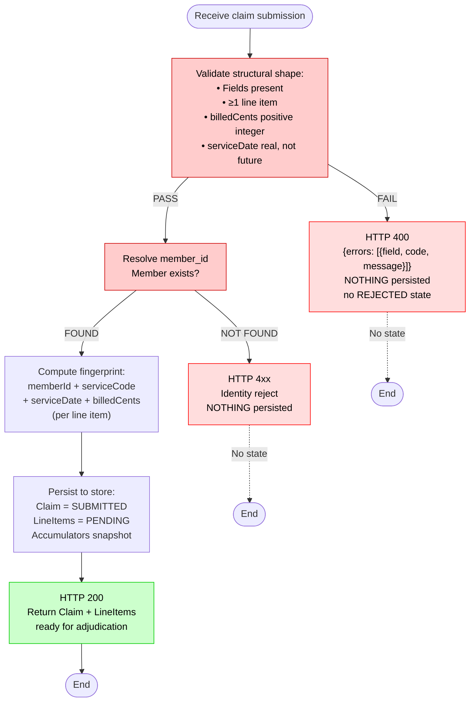
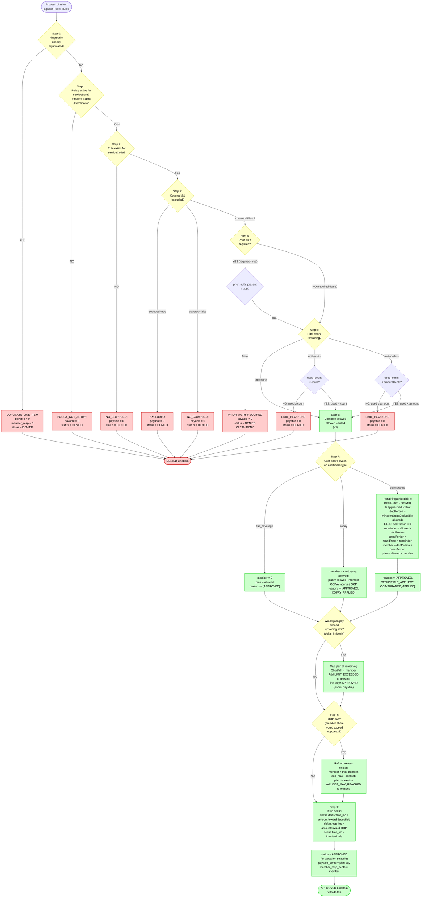
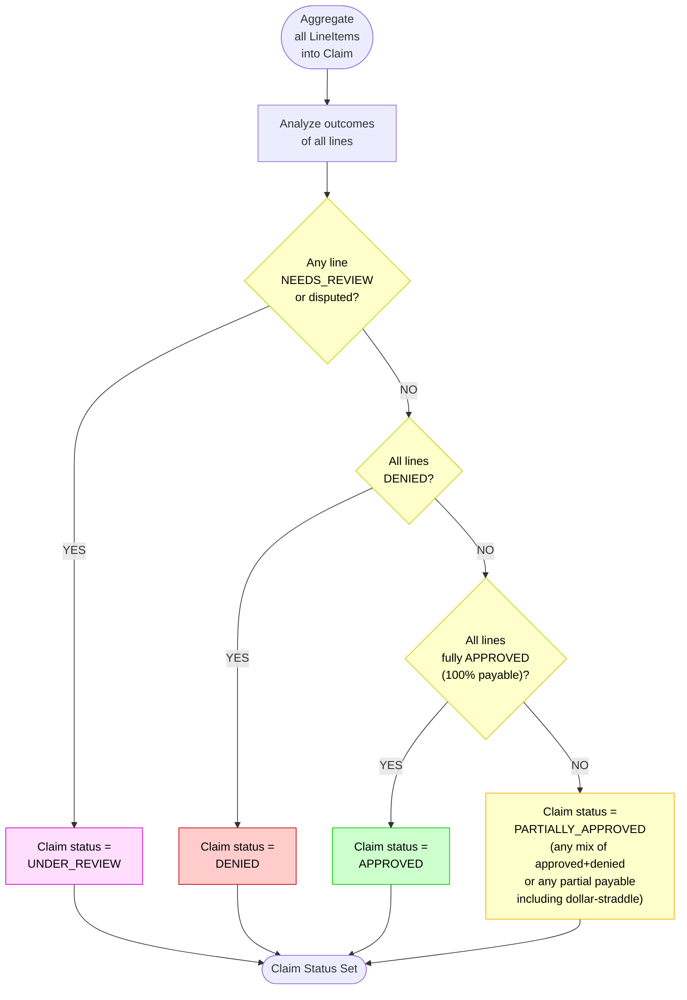
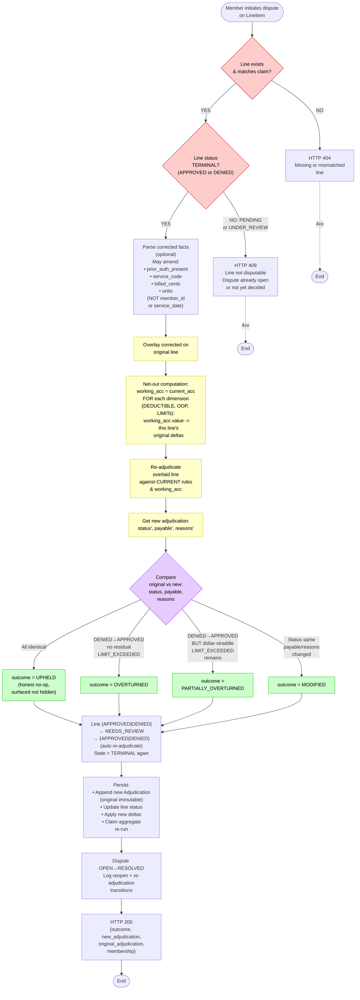

# Claims Adjudication — Scenario Flowcharts

> Happy path + edge cases. Source: docs/adjudication-plan.md + docs/domain-model.md; code wins on drift.

## 1. Intake Flow (C2: Structural Validation → Member Resolution → Persist)

**Happy path:** Well-formed claim, member exists, fingerprint computed, persisted as SUBMITTED + PENDING lines.

**Edge cases:**
- Malformed shape (missing required field, null, undefined) → 400, nothing persisted.
- Non-integer billedCents → 400, nothing persisted.
- Future or invalid serviceDate → 400, nothing persisted.
- Member not found → 4xx identity reject, nothing persisted.
- Zero or negative billedCents → 400, nothing persisted.
- Empty lineItems array → 400, nothing persisted.
- Duplicate fingerprint detected at intake → accepted (will be caught as DUPLICATE_LINE_ITEM at adjudication, not rejected at intake).

---

## 2. Per-Line-Item Adjudication Pipeline (9 Steps + Short-Circuit on Denial)

**Happy path (Example: coinsurance with deductible crossing):**
1. Fingerprint not yet adjudicated ✓
2. Policy active ✓
3. Rule exists ✓
4. Covered, not excluded ✓
5. No prior auth required (or present) ✓
6. Limit remaining ✓
7. Allowed = billed
8. Coinsurance: draw remaining deductible, apply % to remainder
9. OOP check passes
10. Deltas computed → APPROVED with payable + member responsibility

**Edge cases covered:**
- **Duplicate fingerprint** → DUPLICATE_LINE_ITEM (step 0, prevents re-adjudication of same line).
- **Policy not active on service date** → POLICY_NOT_ACTIVE (step 1).
- **No coverage rule for service code** → NO_COVERAGE (step 2).
- **Service explicitly excluded** → EXCLUDED (step 3).
- **Prior auth required but not present** → PRIOR_AUTH_REQUIRED clean DENY (step 4, decision #8).
- **Visit limit exhausted** → LIMIT_EXCEEDED, whole-visit hard stop, no straddle (step 5).
- **Dollar limit exhausted** → LIMIT_EXCEEDED on gate check (step 5), or partial cap + straddle (step 7b).
- **Deductible crossing in coinsurance** → dedPortion capped at remaining deductible; coins % applied to remainder; deterministic rounding on coins (step 7).
- **Dollar-limit straddle** → plan capped at remaining limit; shortfall to member; line stays APPROVED with partial payable + LIMIT_EXCEEDED reason (step 7b).
- **OOP max reached** → excess refunded to plan; member never exceeds cap (step 8).
- **Full coverage** → member 0, plan = allowed, no deductible/OOP touch (step 7).
- **Copay** → member = min(copay, allowed); copay accrues to OOP, not deductible (step 7).

---

## 3. Line Items → Claim Status (Aggregation Logic)

**Happy path:** All lines fully approved → claim APPROVED.

**Edge cases:**
- **All lines denied** → claim DENIED.
- **Mix of approved + denied** → claim PARTIALLY_APPROVED.
- **Any partial-payable line (e.g., dollar-straddle)** → claim PARTIALLY_APPROVED.
- **Any line NEEDS_REVIEW (disputed re-adjudicating)** → claim UNDER_REVIEW.
- **Note:** PARTIALLY_APPROVED is **claim-level only**, never a line state.

---

## 4. Dispute Re-Adjudication Flow (Decision #16)

**Happy path (Example: corrected prior auth):**
1. Member disputes PRIOR_AUTH_REQUIRED line (terminal DENIED).
2. Supplies corrected `prior_auth_present: true`.
3. Guards pass (line exists, is terminal).
4. Overlay correction → new line with prior auth = true.
5. Net-out accumulators (zero deltas since original was DENIED).
6. Re-adjudicate against current rules → now APPROVED.
7. Outcome = OVERTURNED.
8. Persist new adjudication, line moves NEEDS_REVIEW → APPROVED, claim re-aggregates.

**Edge cases:**
- **Line does not exist or belongs to different claim** → 404.
- **Line is PENDING or UNDER_REVIEW** → 409, dispute already open or not yet decided.
- **No corrected facts provided** → re-run identical inputs → outcome = UPHELD (deterministic, honest).
- **Corrected facts provided but don't flip outcome** → outcome = MODIFIED (payable or reasons changed).
- **DENIED → APPROVED but dollar-straddle partial** → outcome = PARTIALLY_OVERTURNED.
- **Original is immutable** → new Adjudication row appended, original never modified.
- **Accumulator invariant** → single-line net-out ensures `value = Σ all lines' latest deltas`.
- **No cross-claim cascade** → intervening sibling lines not re-adjudicated (documented v1 limitation).

---

## 5. Status-Transition Lifecycle (Audit Log)

```mermaid
flowchart TD
    SUBMIT_CLAIM["Claim submitted<br/>SUBMITTED"]
    SUBMIT_CLAIM -->|setStatus<br/>actor=SYSTEM<br/>reason=SUBMIT| TRANS_1["Append transition:<br/>CLAIM: null → SUBMITTED"]
    
    TRANS_1 --> SUBMIT_LINES["Each LineItem<br/>PENDING"]
    SUBMIT_LINES -->|setStatus per line<br/>actor=SYSTEM<br/>reason=SUBMIT| TRANS_2["Append transition:<br/>LINE_ITEM: null → PENDING"]
    
    TRANS_2 --> ADJ["Adjudicate<br/>each line"]
    ADJ -->|setStatus<br/>actor=SYSTEM<br/>reason=ADJUDICATED| TRANS_3["Append transition:<br/>LINE_ITEM: PENDING →<br/>{APPROVED|DENIED}"]
    
    TRANS_3 --> AGG["Aggregate lines<br/>into claim status"]
    AGG -->|setStatus<br/>actor=SYSTEM<br/>reason=AGGREGATED| TRANS_4["Append transition:<br/>CLAIM: SUBMITTED →<br/>{APPROVED|PARTIALLY_APPROVED|<br/>DENIED|UNDER_REVIEW}"]
    
    TRANS_4 --> TERMINAL{"Line disputed?"}
    TERMINAL -->|NO| FINAL_STATE["Claim terminal<br/>LineItems terminal<br/>No more transitions"]
    
    TERMINAL -->|YES| DISPUTE_OPEN["Dispute opened<br/>Line TERMINAL<br/>→ NEEDS_REVIEW"]
    DISPUTE_OPEN -->|setStatus<br/>actor=MEMBER<br/>reason=DISPUTE_REOPEN| TRANS_5["Append transition:<br/>LINE_ITEM: {APPROVED|DENIED}<br/>→ NEEDS_REVIEW"]
    
    TRANS_5 --> RE_ADJ["Re-adjudicate line"]
    RE_ADJ -->|setStatus<br/>actor=SYSTEM<br/>reason=ADJUDICATED| TRANS_6["Append transition:<br/>LINE_ITEM: NEEDS_REVIEW<br/>→ {APPROVED|DENIED}"]
    
    TRANS_6 --> CLAIM_AGG["Re-aggregate claim"]
    CLAIM_AGG -->|setStatus<br/>actor=SYSTEM<br/>reason=AGGREGATED| TRANS_7["Append transition:<br/>CLAIM: UNDER_REVIEW<br/>→ terminal"]
    
    TRANS_7 --> DISPUTE_RESOLVED["Dispute OPEN→RESOLVED<br/>Line & Claim terminal again"]
    
    FINAL_STATE --> END1([End])
    DISPUTE_RESOLVED --> END2([End])
    
    classDef cstatus fill:#e6ccff,stroke:#9933ff,color:#000
    classDef lstatus fill:#ccffcc,stroke:#00cc00,color:#000
    classDef trans fill:#ffffcc,stroke:#cccc00,color:#000
    
    class SUBMIT_CLAIM,TERMINAL,FINAL_STATE,CLAIM_AGG,CLAIM_AGG cstatus
    class SUBMIT_LINES,ADJ,RE_ADJ,DISPUTE_RESOLVED lstatus
    class TRANS_1,TRANS_2,TRANS_3,TRANS_4,TRANS_5,TRANS_6,TRANS_7 trans
```

**Happy path (no dispute):**
1. Claim SUBMITTED (transition logged, actor=SYSTEM, reason=SUBMIT).
2. Lines PENDING (transitions logged per line).
3. Each line adjudicated → APPROVED or DENIED (transitions logged, reason=ADJUDICATED).
4. Claim aggregated to terminal state (transition logged, reason=AGGREGATED).
5. No further transitions.

**With dispute:**
1–4. As above.
5. Member opens dispute on terminal line (transition logged, actor=MEMBER, reason=DISPUTE_REOPEN).
6. Line moves to NEEDS_REVIEW (transient, intermediate state).
7. Auto re-adjudication (transition logged, reason=ADJUDICATED).
8. Line returns to terminal (APPROVED or DENIED).
9. Claim re-aggregates (transition logged, reason=AGGREGATED).

**Key invariants:**
- All transitions atomic with status updates (same transaction).
- `seq` injected logically for determinism (re-runs reproduce same rows except `created_at`).
- Status columns are the source of truth; log is an audit trail (never replayed).
- Timeline (`GET /claims/:id`) surfaces all transitions to member.

---

## Scenario Coverage Matrix

| **Scenario** | **Trigger** | **Outcome** | **Reason Code(s)** | **Status** |
|---|---|---|---|---|
| **INTAKE: Happy path** | Well-formed claim, member exists | Claim SUBMITTED, lines PENDING | — | 200 |
| **INTAKE: Bad shape** | Missing field or null | Rejected | — | 400 |
| **INTAKE: Non-integer cents** | billedCents = 3.14 | Rejected | — | 400 |
| **INTAKE: Future date** | serviceDate > today | Rejected | — | 400 |
| **INTAKE: Invalid date** | serviceDate malformed | Rejected | — | 400 |
| **INTAKE: Member not found** | member_id unknown | Rejected | — | 4xx |
| **INTAKE: Zero/negative billed** | billedCents ≤ 0 | Rejected | — | 400 |
| **INTAKE: Empty lines array** | lineItems = [] | Rejected | — | 400 |
| **ADJUDICATION: Full coverage** | Service code with full_coverage rule | Line APPROVED, payable=allowed, member=0 | APPROVED | 200 |
| **ADJUDICATION: Copay** | Service code with copay rule, allowed ≥ copay | Line APPROVED, member=copay, plan=allowed−copay | APPROVED, COPAY_APPLIED | 200 |
| **ADJUDICATION: Copay clamped** | Service code with copay, allowed < copay | Line APPROVED, member=allowed, plan=0 | APPROVED, COPAY_APPLIED | 200 |
| **ADJUDICATION: Coinsurance, deductible met** | Coinsurance rule, deductible already met | Line APPROVED, member=round(rate×allowed) | APPROVED, COINSURANCE_APPLIED | 200 |
| **ADJUDICATION: Coinsurance, deductible not met** | Coinsurance, remaining deductible < allowed | Line APPROVED, member=dedPortion+coins | APPROVED, DEDUCTIBLE_APPLIED, COINSURANCE_APPLIED | 200 |
| **ADJUDICATION: Coinsurance, allowed < deductible** | Coinsurance, allowed < remaining deductible | Line APPROVED, member=allowed, plan=0 | APPROVED, DEDUCTIBLE_APPLIED | 200 |
| **ADJUDICATION: Duplicate fingerprint** | Same member, service, date, amount already adjudicated | Line DENIED, payable=0 | DUPLICATE_LINE_ITEM | 200 |
| **ADJUDICATION: No rule found** | Service code not in catalog | Line DENIED, payable=0 | NO_COVERAGE | 200 |
| **ADJUDICATION: Covered=false** | Rule exists but covered=false | Line DENIED, payable=0 | NO_COVERAGE | 200 |
| **ADJUDICATION: Excluded rule** | Rule exists, excluded=true | Line DENIED, payable=0 | EXCLUDED | 200 |
| **ADJUDICATION: Policy not active** | Service date before effective or after termination | Line DENIED, payable=0 | POLICY_NOT_ACTIVE | 200 |
| **ADJUDICATION: Prior auth required, missing** | Rule requires auth, prior_auth_present=false | Line DENIED, payable=0, clean DENY | PRIOR_AUTH_REQUIRED | 200 |
| **ADJUDICATION: Prior auth satisfied** | Rule requires auth, prior_auth_present=true | Line processed normally (auth gate passes) | (see cost-share) | 200 |
| **ADJUDICATION: Visit limit not exhausted** | Rule has visit limit, used<count | Line APPROVED normally | (see cost-share) + limit_used += 1 | 200 |
| **ADJUDICATION: Visit limit exhausted** | Rule has visit limit, used≥count | Line DENIED, payable=0 | LIMIT_EXCEEDED | 200 |
| **ADJUDICATION: Dollar limit not exhausted** | Rule has dollar limit, payable < remaining | Line APPROVED, payable as planned | (see cost-share) + limit_used += payable | 200 |
| **ADJUDICATION: Dollar limit exhausted (gate)** | Rule has dollar limit, plan payable would exceed | Line DENIED, payable=0 | LIMIT_EXCEEDED | 200 |
| **ADJUDICATION: Dollar limit straddle** | Rule has dollar limit, plan payable = remaining | Plan capped, shortfall to member, line APPROVED partial | (see cost-share) + LIMIT_EXCEEDED | 200 |
| **ADJUDICATION: OOP cap not reached** | member share < remaining OOP max | Line processed normally | (see cost-share) | 200 |
| **ADJUDICATION: OOP cap reached** | member share would exceed OOP max | Excess refunded to plan, member capped | (see cost-share) + OOP_MAX_REACHED | 200 |
| **AGGREGATION: All approved** | Every line fully approved | Claim APPROVED | — | 200 |
| **AGGREGATION: All denied** | Every line denied | Claim DENIED | — | 200 |
| **AGGREGATION: Mix approved + denied** | Some lines approved, some denied | Claim PARTIALLY_APPROVED | — | 200 |
| **AGGREGATION: Any partial payable** | Any straddle or other partial | Claim PARTIALLY_APPROVED | — | 200 |
| **AGGREGATION: Any line NEEDS_REVIEW** | Any line disputed (re-adjudicating) | Claim UNDER_REVIEW | — | 200 |
| **DISPUTE: Line does not exist** | Dispute on invalid line ID | Rejected | — | 404 |
| **DISPUTE: Line not terminal** | Dispute on PENDING or UNDER_REVIEW line | Rejected | — | 409 |
| **DISPUTE: No corrections, identical re-run** | Dispute with no corrected facts | Outcome UPHELD (honest no-op) | (original reasons) | 200 |
| **DISPUTE: Corrected prior auth, denial flips** | PRIOR_AUTH_REQUIRED line, supply auth | Outcome OVERTURNED, line now APPROVED | (re-derived reasons) | 200 |
| **DISPUTE: Corrected prior auth, straddle** | PRIOR_AUTH_REQUIRED + dollar limit, supply auth | Outcome PARTIALLY_OVERTURNED | (re-derived) + LIMIT_EXCEEDED | 200 |
| **DISPUTE: Corrected billed, payable changes** | Adjust billed_cents, payable/reasons differ | Outcome MODIFIED | (re-derived reasons) | 200 |
| **DISPUTE: Corrected billed, payable same** | Adjust billed_cents, payable unchanged | Outcome MODIFIED (if reasons changed) or UPHELD | (re-derived) | 200 |
| **CROSS-LINE: Two coinsurance, one claim** | Two lines, first draws deductible | Line 2 sees line 1's advanced deductible | (see cost-share) | 200 |
| **CROSS-LINE: Determinism** | Re-submit identical claim + accumulator | Identical results except timestamps | (see originals) | 200 |
| **TRANSITION LOG: Claim path** | Submit → adjudicate → aggregate | Transitions: null→SUBMITTED, SUBMITTED→terminal | SUBMIT, ADJUDICATED, AGGREGATED | 200 |
| **TRANSITION LOG: Dispute path** | Dispute on terminal line | Transitions: {APPROVED\|DENIED}→NEEDS_REVIEW→{...} | DISPUTE_REOPEN, ADJUDICATED, AGGREGATED | 200 |

---

## Key Axioms & Invariants

1. **Money:** `payable_cents + member_responsibility_cents ≡ billed_cents` (every covered line).
2. **Determinism:** Same claim + same starting snapshot → identical results (per-line decisions, deltas, reasons).
3. **Accrual:** Deltas from each line accrue to shared accumulators; line *n* sees line *n*−1's advances within one claim.
4. **Immutability:** Original Adjudication never mutated; dispute appends a new row.
5. **Net-out:** Dispute re-adjudication nets out the disputed line's original deltas from the accumulator (no cross-claim cascade).
6. **Short-circuit:** First denial gate stops the pipeline; no downstream cost-share math.
7. **Rounding:** Only `coinsPortion = round(rate × remainder)` produces fractional cents; `plan = allowed − member` guarantees sum = allowed.
8. **Status source of truth:** Claim/LineItem `status` columns are the source; `status_transition` log is an append-only audit trail (never replayed).

